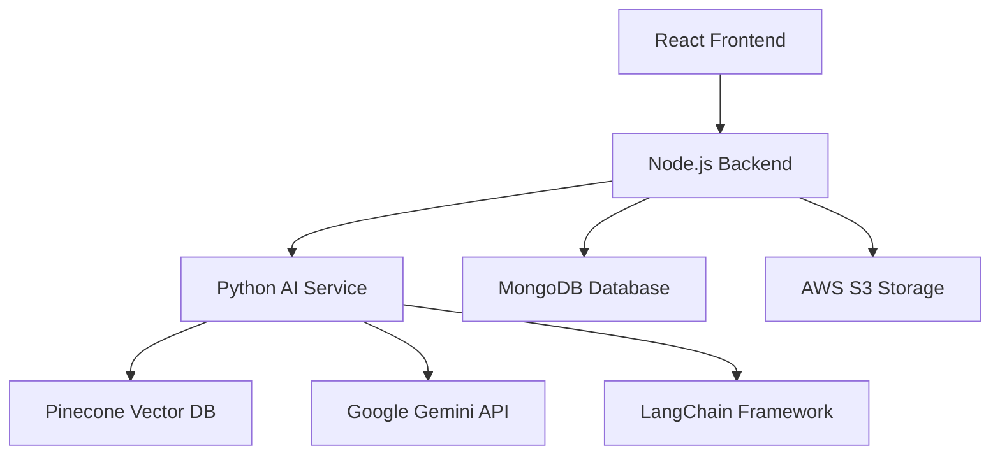

# 🤖 CKsFinBot - AI-Powered Financial Analysis Assistant

<div align="center">


[](https://nodejs.org/)
[](https://reactjs.org/)
[](https://python.org/)
[](https://fastapi.tiangolo.com/)
[](https://mongodb.com/)
[](https://aws.amazon.com/)

*Your intelligent companion for financial document analysis, market insights, and data-driven decision making*

</div>

## 🌟 Overview

CKsFinBot is a sophisticated AI-powered financial analysis platform that combines the power of Large Language Models (LLMs) with advanced document processing capabilities. Built with a modern microservices architecture, it provides intelligent financial insights, document
 analysis, and conversational AI features tailored for finance professionals and enthusiasts.

### ✨ Key Features

- 🧠 **Multi-Modal AI Chat** - Text and image support with Google Gemini integration
- 📄 **Advanced Document Analysis** - PDF, Excel, and financial report processing
- 📊 **Analytical Insights** - Financial ratio calculations and trend analysis
- 🔍 **Multi-Document Search** - Cross-document comparison and analysis
- 💬 **Conversational Interface** - Natural language financial Q&A
- ☁️ **Large File Support** - S3 presigned URLs for files >10MB
- 🎨 **Modern UI/UX** - Google AI Studio inspired interface
- 🔐 **Secure Authentication** - JWT-based user management
- 📱 **Responsive Design** - Works seamlessly across all devices

## 🏗️ Architecture



### 🔧 Tech Stack

#### Frontend
- **React 19** - Modern UI framework
- **Tailwind CSS 4** - Utility-first styling
- **Framer Motion** - Smooth animations
- **Lucide React** - Beautiful icons
- **Axios** - HTTP client
- **Vite** - Fast build tool

#### Backend (Node.js)
- **Express.js** - Web framework
- **MongoDB** - Document database
- **Mongoose** - ODM for MongoDB
- **JWT** - Authentication
- **Multer + AWS S3** - File uploads
- **Serverless Framework** - Deployment

#### AI Service (Python)
- **FastAPI** - High-performance API framework
- **LangChain** - LLM orchestration
- **Google Gemini** - Advanced AI model
- **Pinecone** - Vector database
- **PyPDF** - Document processing
- **Sentence Transformers** - Text embeddings

#### Cloud & Infrastructure
- **AWS S3** - File storage
- **AWS Lambda** - Serverless functions
- **MongoDB Atlas** - Cloud database
- **Pinecone** - Vector search
- **Vercel** - Frontend deployment

## 🚀 Quick Start

### Prerequisites

- Node.js 18+ and npm
- Python 3.11.9 and pip
- MongoDB instance
- AWS account (for S3)
- Google AI API key
- Pinecone account

### 1. Clone the Repository

```bash
git clone https://github.com/KrishChothani/CKsFinBot.git
cd CKsFinBot
```

### 2. Environment Setup

Create `.env` files in each service directory:

#### Frontend (.env)
```env
VITE_API_URL=http://localhost:2590/api/v1
```

#### Node Backend (.env)
```env
PORT=2590
MONGODB_URI=mongodb://localhost:27017/cksfinbot
CORS_ORIGIN=http://localhost:5173

# JWT Secrets
ACCESS_TOKEN_SECRET=your_access_token_secret
ACCESS_TOKEN_EXPIRY=1d
REFRESH_TOKEN_SECRET=your_refresh_token_secret
REFRESH_TOKEN_EXPIRY=10d

# AWS Configuration
AWS_ACCESS_KEY_ID=your_aws_access_key
AWS_SECRET_ACCESS_KEY=your_aws_secret_key
AWS_REGION=us-east-1
AWS_S3_BUCKET_NAME=your-s3-bucket

# Python Service
PYTHON_SERVICE_URL=http://127.0.0.1:8000/api/v1

# Email (Optional)
EMAIL_ID_FOR_VERIFICATION=your_email@gmail.com
EMAIL_PASSWORD_FOR_VERIFICATION=your_app_password
```

#### Python Backend (.env)
```env
# Google AI
GOOGLE_API_KEY=your_google_ai_api_key

# Pinecone
PINECONE_API_KEY=your_pinecone_api_key
PINECONE_ENVIRONMENT=your_pinecone_environment

# AWS (for document access)
AWS_ACCESS_KEY_ID=your_aws_access_key
AWS_SECRET_ACCESS_KEY=your_aws_secret_key
AWS_REGION=us-east-1

# Database
MONGODB_URI=mongodb://localhost:27017/cksfinbot
```

### 3. Installation & Setup

#### Install Frontend Dependencies
```bash
cd Frontend
npm install
```

#### Install Node Backend Dependencies
```bash
cd ../Node-Backend
npm install
```

#### Install Python Backend Dependencies
```bash
cd ../Python-Backend
pip install -r requirements.txt
```

### 4. Database Setup

1. Install MongoDB locally or use MongoDB Atlas
2. Create a database named `cksfinbot`
3. The application will automatically create required collections

### 5. Start the Services

#### Terminal 1: Python AI Service
```bash
cd Python-Backend
uvicorn app.main:app --reload --port 8000
```

#### Terminal 2: Node.js Backend
```bash
cd Node-Backend
npm run dev
```

#### Terminal 3: React Frontend
```bash
cd Frontend
npm run dev
```

### 6. Access the Application

Open your browser and navigate to `http://localhost:5173`

## 📖 Usage Guide

### 🎯 Feature Modes

CKsFinBot offers 5 distinct modes for different use cases:

#### 1. 🤖 Smart Chat
- **Purpose**: Intelligent conversations with text and image support
- **Use Cases**: General financial questions, image analysis, multi-modal queries
- **Example**: "Analyze this chart and explain the trends"

#### 2. 📄 Document Analysis
- **Purpose**: Deep analysis of financial documents and reports
- **Use Cases**: PDF analysis, financial statement review, report summarization
- **Example**: "Summarize the key insights from this quarterly report"

#### 3. 📈 Financial Templete Generation
- **Purpose**: Advanced financial calculations and trend analysis
- **Use Cases**: Ratio calculations, performance metrics, trend analysis
- **Example**: "Calculate the debt-to-equity ratio trends over the last 3 years"
- 
#### 4. 💬 General Conversation
- **Purpose**: Casual finance discussions and educational Q&A
- **Use Cases**: Learning financial concepts, basic questions, definitions
- **Example**: "What's the difference between stocks and bonds?"


### 📁 File Upload Features

#### Supported File Types
- **PDF**: Financial reports, statements, research papers
- **Excel/CSV**: Financial data, spreadsheets, datasets
- **Images**: Charts, graphs, financial diagrams

#### Upload Methods
1. **Drag & Drop**: Simply drag files into the chat interface
2. **Click to Browse**: Use the paperclip icon to select files
3. **Large File Support**: Files >10MB automatically use S3 direct upload

#### File Processing
- Automatic text extraction and indexing
- Vector embeddings for semantic search
- Real-time processing status updates
- Secure cloud storage with public access URLs

### 💬 Chat Interface

#### Welcome Screen
- Feature mode selection with visual cards
- Example prompts for quick start
- Quick action buttons for common tasks
- Professional Google AI Studio inspired design

#### Chat Features
- **Real-time messaging** with typing indicators
- **File attachment** with preview and removal
- **Message history** with conversation persistence
- **Export/Share** functionality for conversations
- **Responsive design** for mobile and desktop

## 🔧 API Documentation

### Authentication Endpoints

```http
POST /api/v1/users/register
POST /api/v1/users/login
POST /api/v1/users/logout
GET  /api/v1/users/current-user
POST /api/v1/users/refresh-token
```

### Conversation Management

```http
GET    /api/v1/conversations
POST   /api/v1/conversations
GET    /api/v1/conversations/:id
DELETE /api/v1/conversations/:id
PATCH  /api/v1/conversations/:id/feature
PATCH  /api/v1/conversations/:id/title
```

### Messaging

```http
POST /api/v1/conversations/:id/messages
```

### Document Upload

```http
POST /api/v1/documents/upload          # Regular upload (<10MB)
POST /api/v1/documents/upload-s3       # S3 direct upload (>10MB)
POST /api/v1/s3/generate-presigned-url # Generate S3 upload URL
```

### AI Processing (Python Service)

```http
POST /api/v1/query              # Process chat queries
POST /api/v1/process-document   # Process uploaded documents
POST /api/v1/delete-documents   # Cleanup documents
```

## 🚀 Deployment

### Frontend Deployment (Vercel/Netlify)

1. Build the frontend:
```bash
cd Frontend
npm run build
```

2. Deploy to Vercel:
```bash
vercel --prod
```

### Backend Deployment (AWS Lambda)

1. Configure AWS credentials
2. Deploy Node.js backend:
```bash
cd Node-Backend
serverless deploy
```

3. Deploy Python backend:
```bash
cd Python-Backend
serverless deploy
```

### Environment Variables for Production

Update your production environment variables with:
- Production database URLs
- Production API endpoints
- Production AWS credentials
- Production API keys

## 🔒 Security Features

- **JWT Authentication** with access and refresh tokens
- **CORS Protection** with configurable origins
- **Input Validation** using express-validator
- **File Upload Security** with type and size restrictions
- **Environment Variable Protection** for sensitive data
- **AWS IAM Roles** for secure cloud resource access

## 🧪 Testing

### Run Frontend Tests
```bash
cd Frontend
npm run test
```

### Run Backend Tests
```bash
cd Node-Backend
npm run test
```

### Run Python Tests
```bash
cd Python-Backend
pytest
```

## 📊 Monitoring & Analytics

- **Error Tracking**: Comprehensive error handling and logging
- **Performance Monitoring**: Response time tracking
- **Usage Analytics**: User interaction metrics
- **Document Processing Stats**: Upload and processing statistics

## 🤝 Contributing

We welcome contributions! Please follow these steps:

1. Fork the repository
2. Create a feature branch (`git checkout -b feature/amazing-feature`)
3. Commit your changes (`git commit -m 'Add amazing feature'`)
4. Push to the branch (`git push origin feature/amazing-feature`)
5. Open a Pull Request

### Development Guidelines

- Follow ESLint configuration for JavaScript/React
- Use Black formatter for Python code
- Write comprehensive tests for new features
- Update documentation for API changes
- Follow conventional commit messages

## 📝 License

This project is licensed under the ISC License - see the [LICENSE](LICENSE) file for details.

## 👥 Team

**Team CKsDev**
- Full-stack development
- AI/ML integration
- Cloud architecture
- UI/UX design

## 🆘 Support

For support and questions:

- 📧 Email: support@cksfinbot.com
- 💬 Discord: [Join our community](https://discord.gg/cksfinbot)
- 📖 Documentation: [docs.cksfinbot.com](https://docs.cksfinbot.com)
- 🐛 Issues: [GitHub Issues](https://github.com/your-username/CKsFinBot/issues)

<!-- ## 🗺️ Roadmap

### Version 2.0 (Coming Soon)
- [ ] Real-time collaboration features
- [ ] Advanced charting and visualization
- [ ] Integration with financial data APIs
- [ ] Mobile app development
- [ ] Advanced AI model fine-tuning

### Version 2.1
- [ ] Multi-language support
- [ ] Voice interaction capabilities
- [ ] Advanced security features
- [ ] Enterprise SSO integration -->

---

<div align="center">

**Made with ❤️ by Team CKsDev**

[⭐ Star this repo](https://github.com/your-username/CKsFinBot) | [🐛 Report Bug](https://github.com/your-username/CKsFinBot/issues) | [💡 Request Feature](https://github.com/your-username/CKsFinBot/issues)

</div>
